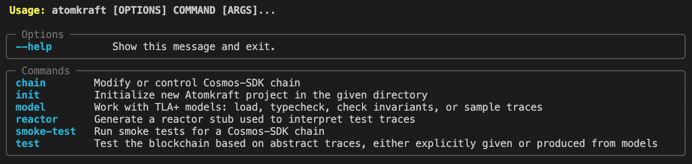

# Atomkraft Installation Instructions

Installing Atomkraft is as easy as `pip install atomkraft`.
However, atomkraft depends on some software:
your mileage may vary based on how much of that software you already have installed.
In the following sections we describe how to install and what features are supported by different dependencies.
If you are looking for a copy&paste solution to get Atomkraft up and running as quickly as possible,
check the [TL;DR section](#tldr).

## Installing Atomkraft

Installing Atomkraft requires [Python](https://www.python.org) 3.8 or newer, together with its package manager [pip](https://pip.pypa.io/en/stable/installation/).

If you don't have Python already installed, please consult the [installation instructions](https://wiki.python.org/moin/BeginnersGuide/Download) for different installation options.
One quick way for installing and managing different Python versions for your system is by using [pyenv](https://github.com/pyenv/pyenv).

Once Python is installed, install Atomkraft with `pip install atomkraft`.

That's it! Please verify that the tool is working by writing `atomkraft` on the command line.
You should see something like this:



## Optional dependencies

Atomkraft is a tool for end-to-end testing of Cosmos SDK based blockchains.
You will need to obtain the binary of a blockchain you want to test.
In order to use the full power of Atomkraft,
you also need [`java` 17 or newer](https://apalache.informal.systems/docs/apalache/installation/jvm.html), for running the Apalache model checker.

### Blockchain binary

If you are interested in Atomkraft, you probably want to test some Cosmos SDK blockchain; so, there is a high probability you have a blockchain binary in your system already. If this is the case, feel free skip the rest of this section.

In case you don't have any Cosmos SDK blockchain binary locally, it should be easy to obtain it. The simplest solution if you want just to play with the tool is to use [Cosmos-SDK](https://github.com/cosmos/cosmos-sdk). The blockchain binary can be compiled locally executing these following commands.

```sh
git clone --depth 1 --branch release/v0.45.x https://github.com/cosmos/cosmos-sdk
(cd cosmos-sdk; make build)
```

The blockchain binary will be at `./cosmos-sdk/build/simd`.

You may also install the compiled binary in your system (requires [setting up Go](https://go.dev/doc/install)), executing directly `(cd cosmos-sdk; make install)` instead of `(cd cosmos-sdk; make build)`.

### Java

This is not required for basic tool usage, e.g. for running standalone test scenarios against a blockchain. For advanced usage, we employ our in-house [Apalache Model Checker](https://apalache.informal.systems); it allows to generate test scenarios from TLA+ models. If you are interested in this functionality, please continue reading.

Atomkraft allows you to download and manage Apalache releases automatically, so you don't need to worry about that. The only prerequisite for using Apalache via Atomkraft is to have Java installed on your system. We recommend version 17 builds of OpenJDK, for example [Eclipse Temurin](https://adoptium.net/) or [Zulu](https://www.azul.com/downloads/?version=java-17-lts&package=jdk#download-openjdk). In case you don't have Java installed already, please download and install the package suitable for your system.

## TL;DR

#### `ubuntu`

```
apt update -y && apt upgrade -y
apt install python3-pip git golang curl default-jre -y
pip install --upgrade poetry
pip install --upgrade atomkraft
git clone --depth 1 --branch v7.0.3 https://github.com/cosmos/gaia.git
(cd gaia; make build)
```

#### `macOS`

```
brew install pyenv git go java
pyenv install 3.10.6
pyenv global 3.10.6
pip install --upgrade atomkraft
git clone --depth 1 --branch v7.0.3 https://github.com/cosmos/gaia.git
(cd gaia; make build)
```

When you are done using Atomkraft, run `pyenv global system` to get back to using the system python as default.

#### `archlinux`

```
pacman -Syu python-pip python-poetry git make go jre-openjdk gcc --noconfirm --needed
pip install --upgrade atomkraft
git clone --depth 1 --branch v7.0.3 https://github.com/cosmos/gaia.git
(cd gaia; make build)
```
