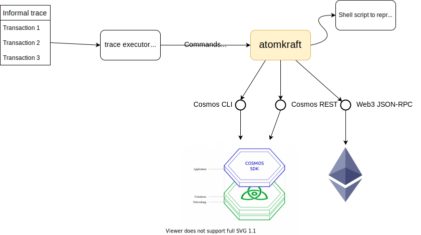

# Atomkraft

*End-to-end testing of Cosmos blockchains should be easy and reproducible!*

Atomkraft is a python package that provides you with a thin layer for executing
[Informal traces](https://apalache.informal.systems/docs/adr/015adr-trace.html)
against a Cosmos blockchain.

Atomkraft offers the following features:

 - Executing [Cosmos transactions via CLI](./src/atomkraft/cosmos.py).

 - Querying for account balances via the [REST API](./src/atomkraft/cosmos.py).

 - [Parsing Informal traces](./src/atomkraft/itf_parser.py) into convenient
   python-native data structures.

Our principle design decision was to make Atomkraft as thin as possible and
make it easy to hack, because every blockchain comes with its own quirks, APIs,
and endpoints. Atomkraft does not depend on complex verification/testing tools,
though advanced tools such as [Apalache](https://apalache.informal.systems/)
can be easily integrated into the testing workflow with Atomkraft.  This
approach proved itself in several audits, where we had to deal with Cosmos SDK
and Ethereum Virtual Machine (and even both at the same time!).

The diagram below shows the data flow in an Atomkraft setup:



## Examples

Check how we test [Delegation and transfers in Cosmos
SDK](./examples/cosmos-sdk).

## Install

To build atomkraft, run the following commands:

```sh
git clone git@github.com:informalsystems/atomkraft.git
cd atomkraft
make build && make install
```

