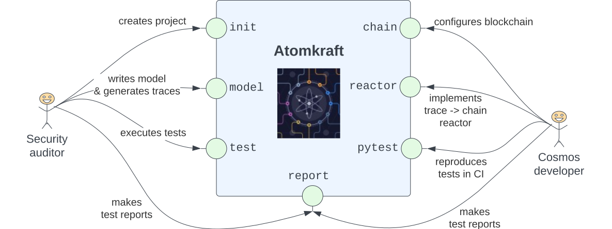

# Atomkraft: E2E testing for Cosmos blockchains

The [Cosmos Network](https://cosmos.network) of [IBC](https://ibcprotocol.org)-connected blockchains is growing tremendously fast. There is one aspect though, which has not been fully addressed yet, namely **quality assurance**: how do we make sure that Cosmos-based blockchains are secure, and don't contain security issues that pose hazards for user funds?

**Atomkraft** is our answer to that question: it allows to generate and execute massive end-to-end (E2E) test suites for Cosmos SDK based blockchains. When designing the tool, we keep two main categories of users for it: **security auditors**, and **Cosmos SDK blockchain developers**. Those roles are abstract and non-exclusive, and they serve only to summarize some important concerns wrt. the deployed blockchains. Is Atomkraft the right tool for you? Below are some possible hints.

Atomkraft is likely to benefit you as an (abstract) _security auditor_ if:

- your blockchain (or the new version of it) is about to be launched, but you are unsure whether incentivized testnets allowed you to discover all critical vulnerabilities;
- you are on tight time schedule for the new release, and you feel that the implementation has been rushed a little, so you are unsure that all corner cases of the new functionality has been covered.

Atomkraft is likely to benefit you as an (abstract) _Cosmos SDK developer_ if:

- the new functionality you've implemented interacts in non-trivial ways with other important modules (e.g. with [bank](https://docs.cosmos.network/master/modules/bank/), [staking](https://docs.cosmos.network/master/modules/staking/), [authz](https://docs.cosmos.network/master/modules/authz/), etc.), and you are unsure whether some important invariants of those modules are preserved.
- you want to grow and maintain a regression test suite for the blockchain modules you are developing, to make sure of their correctness as your blockchain evolves
- you want to automate quality assurance for your blockchain modules, and integrate fast E2E testing solution that's executed on every PR.

