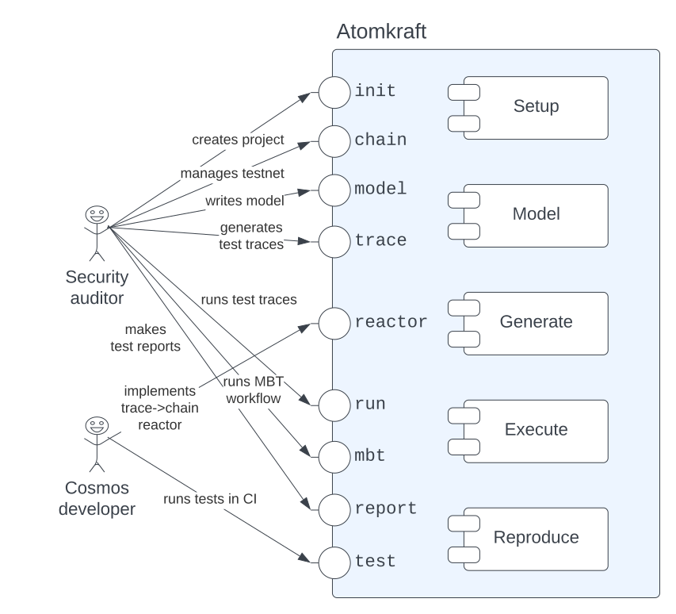

# ADR-01: Atomkraft CLI

| authors           | revision | revision date  |
| ----------------- | --------:| --------------:|
| Andrey Kuprianov  |        1 | July 12, 2022  |

This ADR describes Atomkraft general organizational principles, and how it is supposed to be used by the users, which artifacts it produces, and how it is decomposed into main components. Concrete functionality of those components is delegated to subsequent ADRs.





Below we specify only the outcomes for successful command execution. Upon unsuccessful command execution, the error should be reported to the user, and no remnants (e.g. zombie processes, or additional files beyond requested) should remain.

## General principles

The tool CLI commands represent top-level user workflows, where each workflow is able to bring value to a user. Our primary user for the CLI is the auditor, who comes to a new Cosmos-SDK based project, and wants to test it in a limited amount of time.

Each CLI command produces a certain artifact (e.g. a blockchain configuration, or a Python reactor stub). Those intermediate artifacts can be customized, and then seamlessly integrated back in the workflows that depend on them.

An example workflow with customization points:

1. A user comes to the new blockchain. They want to check that Atomkraft is able to interact with it, so they run `atomkraft testnet ...`
   - The produced configuration and a Python script that sets up a blockchain using the configuration is independently runnable. The user can customize the script; it will be picked up at later stages.
2. The user writes a TLA+ spec, and wants to connect it to the blockchain they set up in step 1. They run `atomkraft reactor ...`; the reactor stub is generated.
   - The user customizes the stub, and fills the gaps. The stub, together with the previous script for blockchain setup is runnable independently, but are also picked up automatically at later stages.
3. The user wants to test the blockchain set up in step 1, using the model and the reactor developed in step 2. They run `atomkraft test ...`. They experiment with different test assertions.
   - For the test traces that they find interesting, or that are failing on the blockchain, the user tells the tool to store them as regression tests. The regression Python script is generated, which can be executed independently.
4. The user asks the tool to generate a report for the failed tests, using `atomkraft report ...`. The user sends the report to the developers.
   - The developers fix the bugs, and ask the user to recheck the regression test on them. The user runs `atomkraft regression ...`, which automatically reruns previously stored regression tests.
5. The blockchain developers are happy about the interaction, and ask the auditor to provide them the regression tests. The auditor sends them the Python regression test generated in step 4. 

From the scenario outlined above, we start with the very minimal set of commands that will constitute the Atomkraft prototype.


## Initialize the project

A user wants to start applying Atomkraft to a new Cosmos SDK based project defined by a specialized binary (such as `gaiad`), so that the command checks that it can interoperate with the provided binary, and sets up all necessary folder structure and files in it.

Upon successful command execution, it should be guaranteed that Atomkraft is able to interact with it; also possibly some set of basic tests should be executed against it. The proposed command format:

```
atomkraft init <binary> [<config>]
```

where: 
- `<binary>` is the (path to) blockchain binary;
- `<config>` is the (path to) TOML file with the genesis and node configuration.


## Generate test trace

A user has written a TLA+ model, and wants to generate some traces for test assertions from the model, so that they can understand the model behavior, and use some of the generated test traces later for executing on a testnet. 

Upon successful command execution, the generated test trace in the ITF format should be saved to disk. The proposed command format:

```
atomkraft trace <model> <model-config> <test-assertion> <path-to-trace>
```
where: 
- `<model>` is the (path to) TLA+ model;
- `<model-config>` is the (path to) TOML file with the model and model checker configuration;
- `<test-assertion>` is the name of the model operator describing the desired test trace.
- `<path-to-trace>` is the path where to store the generated trace.


## Generate reactor stub

A user has either a TLA+ model, or a test trace, and wants to write a reactor that transforms trace steps into transactions, so that they can be executed on a testnet. For that purpose, Atomkraft generates a reactor stub, which user only needs to fill with concrete actions.

Upon successful command execution, a Python file should be generated, which contains Python function stubs for all relevant model actions.

```
atomkraft reactor [<action-list>] [<model-or-trace>] <reactor-stub-file> 
```
where: 
- `<model-or-trace>` is the (path to) TLA+ model, or to ITF trace;
- `<reactor-stub-file>` is the (path to) Python reactor stub to be generated.


## Run a trace against the testnet

WIP name: **Thrust a trace**

```
atomkraft run <trace> 
```

## Test the blockchain

WIP name: **Blast the testnet**

```
atomkraft test <model> <test-assertion>
```


## Launch a testnet (nice-to-have)

A user wants to set up a Cosmos-SDK testnet, using a specific binary of their choice, so that the testnet can later be used either for exploration or testing.  

Upon successful command execution, the testnet should be in operational step, and keep running; the testnet mnemonic is returned to the user. The proposed command format:

```
atomkraft testnet <binary> <genesis-config> <node-config>
```

where: 
    
- `<binary>` is the name or path to a Cosmos-SDK based blockchain binary (e.g. `gaiad`);
- `<genesis-config>` is the (path to) TOML file with the genesis configuration;
- `<node-config>` is the (path to) TOML file with the node configuration.

It should be possible to terminate one or all of the previously launched testnets:
- `atomkraft terminate <mnemonic>` should terminate the testnet launched previously under `<mnemonic>`;
- `atomkraft terminate <binary>` should terminate all testnets launched previously using `<binary>`;
- `atomkraft terminate` should terminate all previously launched testnets.

## Explore a testnet (nice-to-have)

A user wants to explore the running testnet visually (e.g. validators or transactions), so that they see the transactions live as they are executed. 

Upon successful command execution, a browser window is opened with the blockchain explorer for the specified testnet. The proposed command format:

```
atomkraft explorer [<address>]
```

where `<address>` is the optional address for the blockchain explorer to connect to. If omitted, the explorer should connect to the testnet launched last.
